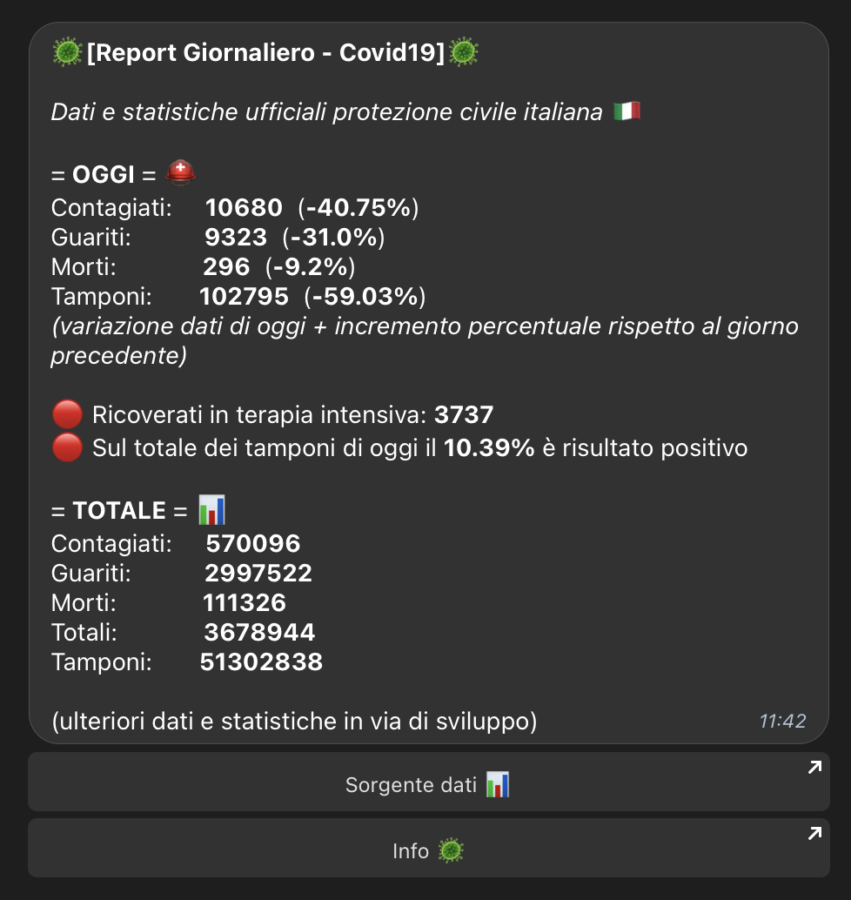
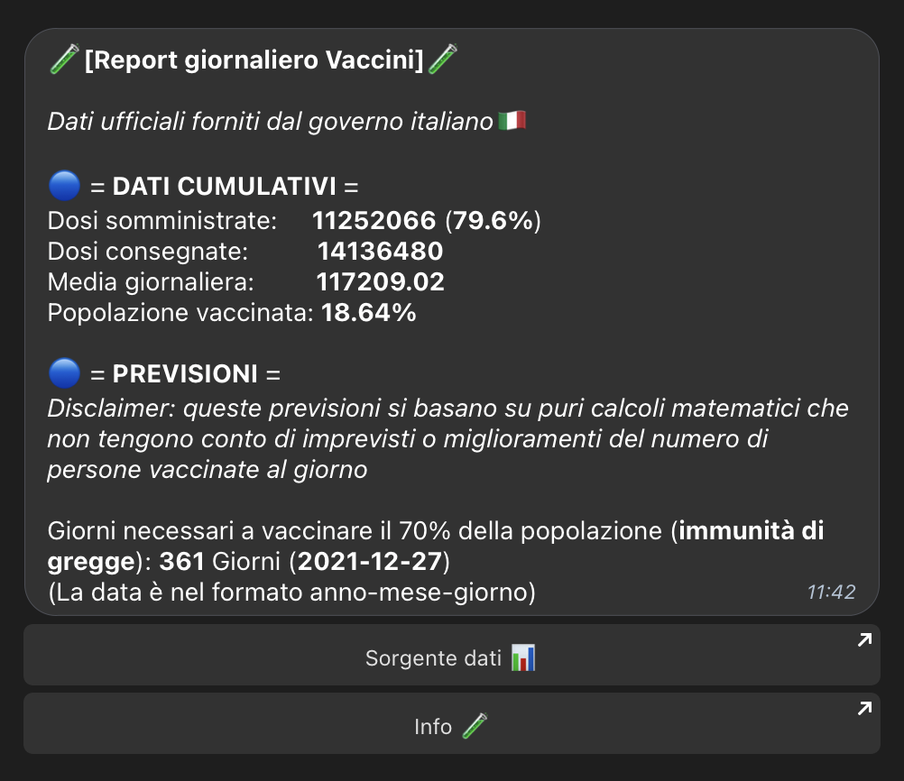
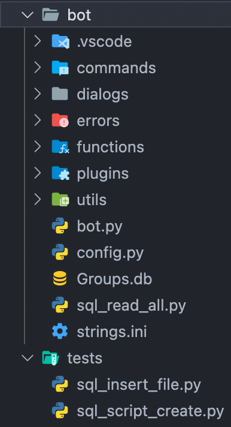

# covid19bot

**Link**: [@covid19italtreportbot](t.me/covid19italyreportbot)

**[it]** Bot Telegram che fornisce dettagliati aggiornamenti giornalieri riguardo la situazione covid-19 in Italia (contagi, morti, guariti, ...)

**[en]** This Telegram bot provides daily and detailed updates about covid-19 situation in Italy

## Table of Contents

- [Features and Commands](https://github.com/mik3sw/covid19bot#Features-and-Commands)
- [How to Run](https://github.com/mik3sw/covid19bot#How-to-Run)
- [Code Structure](https://github.com/mik3sw/covid19bot#Code-Structure)
- [Scripts](https://github.com/mik3sw/covid19bot#Scripts)

## Features and Commands

- [/start](): It return a generic start message (every distinguished bot has one! 🧐)
- [/help](): It return the help message with all available commands (and which permission is required for each)
- [/day](images/dailyreport.png): It return the covid19 report with the lastest data provided by Italian Government
- [/vax](images/dailyvax.png): It return the vaccines report with the lastest data provided by Italian Government

  
  

- [/addme]() register yourself in database to receive daily updates
- [/delme]() delete yourself from database
- [/addgroup]() register your group id in database (admin-only)
- [/delgroup]() delete your group id in database (admin-only)

## How to Run

QuickStart guide to run the bot.

1. Install dependencies
<code> pip install python-telegram-bot</code>,
<code>pip install requests</code>,
<code>pip install sqlite3</code>;
2. Create database by running <code>tests/sql_script_create.py</code> and move the new created <code>Groups.db</code> into bot folder;
3. Edit <code>bot/config.py</code> with your settings;
4. (Optional) Customize commands output by editing <code>strings.ini</code>;
5. Run the bot with <code>python3 bot.py</code>

## Code Structure

Here a **quick expanation** of what i've done 🚀. I think the code is quite neat, understandable and not redundant, except for covid and vaccines function/classes. It can be better  

- **commands**
    - admin-only commands
    - user commands
- **dialogs**
    - welcome function when bot is added to groups
- **errors**
    - console log messages
    - error messages sent to admins
- **function**
    - database and messages generic functions
- **plugins**
    - covid19 data processing
    - vaccines data processing
- **utils**
    - check permissions of commands

[Full code tree here!](images/tree.png)  

## Scripts

HELP! My scrips work, but they are not so good and fast, if you want you can to contribute to make them better and faster! 

### Covid19 script

(2020) The daily report function is controlled by <code>plogins/covid19_script.py</code>. I created a Class that through requests gets data from Protezione Civile and with <code>plogins/covid19.py</code> compose the message (/day)
I also created a separated package here https://github.com/mik3sw/Covid-19-Italy, you can import it in your python code.

### Vaccines script

(2021) I also created a daily report about vaccines in Italy: this function is controlled by <code>plogins/vaccines_script.py</code>. I created a Class that through requests gets data from Protezione Civile and with <code>plogins/vaccines.py</code> compose the message (/vax)

